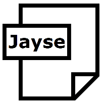

# Jayse

 

Traverse and modify JSON documents with immutable data structures and lossless conversion to and from statically typed objects in Dart and .NET.

<small>**Note**: this repo has two separate libraries (Dart/.NET) for working with JSON with the same name. They are currently different, but the aim for the long term is to bring them together and make them converge.</small>

[Dart Package](src/dart_jayse)

[C# Package](src/dotnet)

## What Is It And Why?

[JSON](https://www.json.org/json-en.html) is a simple data structure and textual representation that allows the storage and transfer of data in a human readable format. Most of the web uses JSON for Web API data transfer. 

Unlike data structures in statically typed languages like C# and Dart, JSON is a dynamic structure that can contain any type of data. This poses challenges for mapping JSON to statically typed languages. JSON is in stark contrast with comparable structures like [Protobuf](https://protobuf.dev/), which is modelled after statically typed languages and is designed to be converted to and from them.

JSON grew up alongside JavaScript, which is a dynamic language. JavaScript has an `undefined` type, which is not present in statically typed languages lke Dart or C#. This means that JavaScript is sensitive to the difference between `null` and `undefined` when converting from JSON to objects, or when serializing objects back to JSON. Not only this, JavaScript preserves information like fields with incorrect data types when converting to and from JSON. 

Dart and C# cannot handle the undefined (absent) fields and data is lost when converting to a statically typed object that doesn't make a distinction between `null` and `undefined`. This is not a problem when you're in control of the backend, but it becomes a problem when you have communicate with APIs that are not under your control. If the API distinguishes between `null` and `undefined`, you can lose data when converting to and from JSON.

The Dart version of Jayse aims at fixing this issue, while providing a modern, type-safe API that allows you to work with JSON in a way that is similar to working with statically typed objects. The .NET version of Jayse, which started as an experiment, is a little different, but the aim for the long term is to bring them together and make them converge.